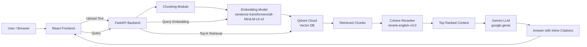

# Mini RAG Application (Track B)

## Overview  
This is a Mini Retrieval-Augmented Generation (RAG) application that allows users to upload text documents, query them, and receive grounded answers with inline citations.

---

## Tech Stack  
- **Backend**: FastAPI  
- **Frontend**: React  
- **Vector Database**: Qdrant (Cloud)  
- **Embeddings**: `sentence-transformers/all-MiniLM-L6-v2`  
- **Reranker**: Cohere Rerank (`rerank-english-v3.0`)  
- **LLM**: Google Gemini (`google.genai` SDK)  
- **Hosting**: HuggingFace Spaces (backend), Vercel (frontend)

---

## Architecture  

**Flow:**  
Upload → Chunk → Embed → Store (Qdrant)  
Query → Embed → Retrieve → Rerank → LLM Answer → Citations  


---

## Chunking Parameters
- **Chunk Size**: 1000 tokens
- **Overlap**: 150 tokens
- **Reason**: Preserves context across chunk boundaries while keeping chunks semantically meaningful.

---

## Retriever Configuration
- **Vector Database**: Qdrant
- **Distance Metric**: Cosine similarity
- **Embedding Model**: sentence-transformers/all-MiniLM-L6-v2
- **Embedding Size**: 384
- **Collection Name**: documents
- **Upsert Strategy**: UUID-based overwrite

---

## Reranker
- **Provider**: Cohere
- **Model**: rerank-english-v3.0
- Improves relevance ordering of retrieved chunks before answer generation.

---

## Providers Used
- **Embeddings**: Sentence Transformers
- **Reranker**: Cohere
- **LLM**: Google Gemini
- **Vector DB**: Qdrant

---

## API EndPoints
### Health
#### GET /health
**Response**:
```json
{ "status": "ok" }
```

### Upload Document
#### POST /upload
**Request**:
```json
{
  "id": "doc1",
  "text": "your document text here",
  "metadata": {}
}
```
**Response**:
```json
{ "message": "Document indexed successfully." }
```

### Query
#### POST /query
**Request**:
```json
{
  "query": "What is LangChain?",
  "top_k": 3
}
```
**Response**:
```json
{
  "answer": "LangChain is a framework for building applications powered by large language models. [1]",
  "citations": ["[1] Source: {'source': 'doc1', 'chunk': 0}"],
  "latency": 0.45,
  "token_estimate": 180,
  "cost_estimate": 0.0
}
```

---

## Evaluation (Gold Set)

**Document:**

> “LangChain is a framework for developing applications powered by large language models. It provides chains, agents, and memory.”

| Question                         | Expected Answer          | Result |
|----------------------------------|--------------------------|--------|
| What is LangChain?               | Framework for LLM apps   | ✅     |
| What does LangChain provide?     | Chains, agents, memory   | ✅     |
| Is LangChain used for LLM apps?  | Yes                      | ✅     |
| What type of framework is it?    | AI framework             | ✅     |
| What problem does it solve?      | Helps build LLM apps     | ❌     |

**Accuracy:** 4 / 5 = **80%**

**Observation:**  
Answers are grounded with citations. Some paraphrasing occasionally omits details.

---

## Quickstart
### Backend
```bash
pip install -r requirements.txt
uvicorn main:app --reload
```
### Frontend
```bash
npm install
npm start
```

---

## Deployment
- **Backend**: HuggingFace Spaces
- **Frontend**: Vercel
- API keys are stored securely using environment variables.

---

## Tradeoffs / Remarks
- Token and cost estimates are approximate.
- Designed for small to medium document collections.
- Single-document upload (can be extended to batch ingestion).
- Not optimized for large-scale multi-tenant usage.

---

## Resume

You can view my resume here:  
🔗 **[View Resume](https://drive.google.com/file/d/1jXXItduSQuqJF13eLAPzvypvmAgHT6s7/view?usp=sharing)**
