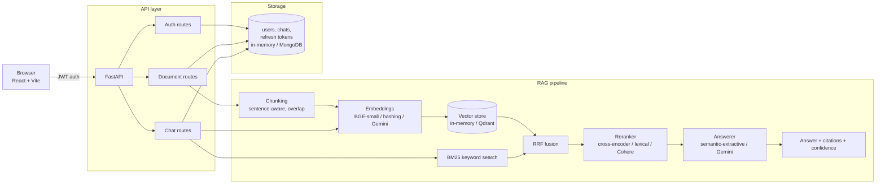

# RAG Application - Full-Stack Retrieval-Augmented Generation Platform

A production-style RAG platform where users sign up, upload documents into a
private knowledge base, and ask questions that are answered **with inline
citations** grounded in their own documents.

Built with a **provider-agnostic architecture**: every external service
(LLM, embeddings, reranker, vector DB, database) has a free local
implementation, so the entire app runs end-to-end **with zero API keys** -
then upgrades seamlessly when keys are added. Retrieval is **hybrid**
(dense vectors + BM25 keyword search, fused with Reciprocal Rank Fusion),
and the local stack ships with real **neural models** (no key required).

| | Local default (no keys) | With API keys |
|---|---|---|
| **Embeddings** | Neural **BGE-small** (fastembed/ONNX), hashing fallback | Gemini `text-embedding-004` |
| **Retrieval** | Hybrid: dense + BM25, fused with RRF | Hybrid + Qdrant |
| **Reranker** | Neural cross-encoder (fastembed), lexical fallback | Cohere Rerank v3 |
| **Answers** | Extractive with **semantic** sentence selection | Google Gemini |
| **Vector store** | In-memory (cosine) | Qdrant Cloud |
| **Database** | In-memory | MongoDB Atlas |

> The neural local models download once via `fastembed` (small quantized
> ONNX files, ~120 MB total). If `fastembed` isn't installed, the app
> automatically falls back to hashing embeddings + lexical reranking, so it
> always runs. Fully responsive across desktop and mobile.

---

## Features

- **Authentication** - register / login / logout with bcrypt password
  hashing, short-lived JWT access tokens, and rotating revocable refresh
  tokens.
- **Private multi-tenant knowledge bases** - every document and vector is
  namespaced by user; users can never retrieve each other's content
  (covered by tests).
- **Grounded answers with citations** - every answer cites the exact
  chunks it came from, with source title, chunk index, relevance score and
  snippet.
- **Answer confidence scoring** - each response carries a 0–100 grounding
  score (from retrieval strength), shown as an animated ring.
- **AI-suggested questions** - starter questions auto-generated from the
  salient terms in your indexed documents.
- **Answer feedback** - thumbs up/down per answer, rolled into workspace
  analytics.
- **Workspace analytics** - live dashboard of documents, chunks, questions,
  average confidence, average latency and helpful votes.
- **Scoped questioning** - restrict a question to selected documents.
- **Chat history** - persisted per user, clearable.
- **Security hardening** - per-IP rate limiting, security headers, CORS
  allowlist, account-enumeration-safe login errors, password policy.
- **Graceful degradation** - if a provider call fails at runtime, the
  pipeline falls back to extractive answering instead of erroring.

### Experience

A polished, animated single-page app: a 3D constellation background with
aurora lighting, a rotating 3D logo, glassmorphism panels with cursor-reactive
tilt, "streaming" typewriter answers, an animated confidence ring, count-up
stat cards, drag-and-drop upload, toast notifications, and a **dark / light
theme toggle**. **Fully responsive** - on phones the dashboard becomes a
Documents/Chat tab switcher with touch-friendly controls.

## Architecture


```mermaid
flowchart LR
    U[Browser<br/>React + Vite] -->|JWT auth| A[FastAPI]

    subgraph API layer
        A --> AU[Auth routes]
        A --> DO[Document routes]
        A --> CH[Chat routes]
    end

    subgraph RAG pipeline
        DO --> C[Chunking<br/>sentence-aware, overlap]
        C --> E[Embeddings<br/>BGE-small / hashing / Gemini]
        E --> V[(Vector store<br/>in-memory / Qdrant)]
        CH --> E
        CH --> BM[BM25 keyword search]
        V --> F[RRF fusion]
        BM --> F
        F --> R[Reranker<br/>cross-encoder / lexical / Cohere]
        R --> L[Answerer<br/>semantic-extractive / Gemini]
        L --> CIT[Answer + citations + confidence]
    end

    subgraph Storage
        AU --> DB[(users, chats,<br/>refresh tokens<br/>in-memory / MongoDB)]
        DO --> DB
        CH --> DB
    end
```

Full design rationale in [ARCHITECTURE.md](ARCHITECTURE.md).

## Tech stack

- **Backend**: FastAPI (Python 3.11), Pydantic v2, PyJWT, bcrypt
- **Frontend**: React 18 + Vite, React Router, hand-rolled CSS design system
- **Storage**: in-memory ➜ MongoDB (Motor) · in-memory vectors ➜ Qdrant
- **Retrieval**: hybrid dense + BM25 with Reciprocal Rank Fusion
- **Models**: local neural (fastembed BGE-small + cross-encoder) ➜ Gemini
  (LLM + embeddings), Cohere (rerank)
- **Tests**: pytest - 35 tests covering auth, isolation, ingestion, hybrid
  retrieval, BM25, confidence, suggestions, feedback and analytics
- **Responsive**: desktop split-view + mobile tabbed layout
- **Deploy**: Docker → Render / Northflank (API), Vercel (frontend)

## Project structure

```
backend/
  app/
    main.py            # app factory, middleware, router mounting
    core/              # config, JWT + bcrypt security, rate limiter
    api/routes/        # auth, documents, chat, health
    schemas/           # request/response models (validation)
    db/                # repository interfaces + memory & Mongo adapters
    rag/               # chunking, embeddings, vector stores, reranker,
                       # answerers, pipeline orchestration
  tests/               # pytest suite (runs with zero keys)
  Dockerfile
frontend/
  src/
    api/client.js      # fetch wrapper, token refresh on 401
    context/           # auth, theme (dark/light), toast
    hooks/             # useTypewriter, useCountUp
    pages/             # Login, Register, Dashboard
    components/        # Navbar, DocumentsPanel, ChatPanel, StatsBar,
                       # ConfidenceRing, AnimatedBackground, TiltCard, Logo, ...
    styles/global.css  # design system (themed, animated)
render.yaml            # one-click Render blueprint
DEPLOYMENT.md          # step-by-step hosting guide
```

## Quickstart (no API keys needed)

**Backend**

```bash
cd backend
python -m venv .venv
.venv\Scripts\activate          # Windows   (macOS/Linux: source .venv/bin/activate)
pip install -r requirements.txt
uvicorn app.main:app --reload   # http://127.0.0.1:8000 - docs at /docs
```

**Frontend** (second terminal)

```bash
cd frontend
npm install
npm run dev                     # http://localhost:5173 (proxies /api to :8000)
```

Register an account, upload a `.txt`/`.md` file or paste text, and ask
questions. The navbar shows which providers are active.

**Tests**

```bash
cd backend
pip install -r requirements-dev.txt
pytest
```

## Configuration

Copy `backend/.env.example` to `backend/.env`. Everything is optional:

| Variable | Effect when set |
|---|---|
| `JWT_SECRET` | Stable signing key (required in production) |
| `MONGODB_URI` | Persistent users/documents/chats in MongoDB |
| `QDRANT_URL` + `QDRANT_API_KEY` | Persistent vectors in Qdrant |
| `GEMINI_API_KEY` | LLM answers via Gemini |
| `EMBEDDING_PROVIDER` | `auto` (default: neural BGE-small, hashing fallback) · `local` · `fastembed` · `gemini` |
| `RERANKER_PROVIDER` | `auto` (default: neural cross-encoder, lexical fallback) · `local` · `fastembed` |
| `COHERE_API_KEY` | Neural reranking via Cohere (overrides `RERANKER_PROVIDER`) |
| `CORS_ORIGINS` | Comma-separated allowed frontend origins |

## API overview

| Method | Endpoint | Auth | Description |
|---|---|---|---|
| POST | `/api/auth/register` | – | Create account, returns token pair |
| POST | `/api/auth/login` | – | Login, returns token pair |
| POST | `/api/auth/refresh` | – | Rotate refresh token |
| POST | `/api/auth/logout` | – | Revoke refresh token |
| GET | `/api/auth/me` | ✅ | Current user |
| POST | `/api/documents` | ✅ | Ingest (chunk → embed → index) |
| GET | `/api/documents` | ✅ | List documents |
| DELETE | `/api/documents/{id}` | ✅ | Delete document + vectors |
| POST | `/api/chat/query` | ✅ | Ask; returns answer + citations + confidence |
| GET | `/api/chat/suggestions` | ✅ | Auto-generated starter questions |
| POST | `/api/chat/{id}/feedback` | ✅ | Rate an answer (up/down) |
| GET | `/api/chat/history` | ✅ | Chat history |
| DELETE | `/api/chat/history` | ✅ | Clear history |
| GET | `/api/stats` | ✅ | Workspace analytics |
| GET | `/api/health` | – | Status + active providers |

Interactive docs: `http://127.0.0.1:8000/docs`.

## Deployment

See [DEPLOYMENT.md](DEPLOYMENT.md) for step-by-step guides:
Render **or** Northflank for the API (Docker), Vercel for the frontend.

## Roadmap

See [TODO.md](TODO.md).
